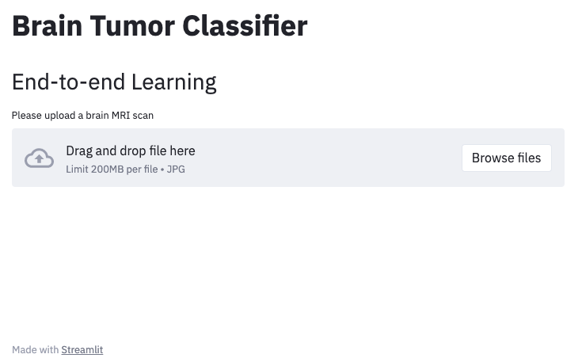
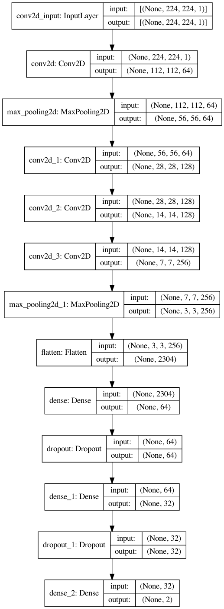

# Brain Tumor Classifier Demo App

This simple web application allows to interactively test a deep learning model to detect tumors in the brain. 
A CNN was created and trained from scratch.

The following figure shows the developed CNN.

